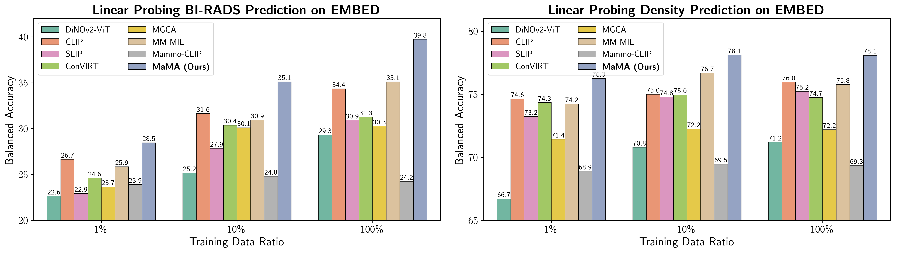

# MaMA: Multi-View and Multi-Scale Alignment for Contrastive Language-Image Pre-training in Mammography

#### By *[Yuexi Du](https://xypb.github.io/), [John A. Onofrey](https://medicine.yale.edu/profile/john-onofrey/), and [Nicha C. Dvornek](https://www.hellonicha.com/)* from Yale University.

[](./LICENSE) [](https://arxiv.org/abs/2409.18119v2)



This is the official implementation of paper **MaMA**: *"Multi-View and Multi-Scale Alignment for Contrastive Language-Image Pre-training in Mammography"* (accepted by **IPMI 2025** for **Oral presentation**)

## News

- [March 2025] We now provide the pre-trained model download at Huggingface! You can load our pre-trained ViT within a few lines of code now!
- [March 2025] Paper is accepted by **IPMI 2025** for oral presentation!🎉 The code and pre-trained model are released!

## Abstract:

> Contrastive Language-Image Pre-training (CLIP) demonstrates strong potential in medical image analysis but requires substantial data and computational resources. Due to these restrictions, existing CLIP applications in medical imaging focus mainly on modalities like chest X-rays that have abundant image-report data available, leaving many other important modalities underexplored. Here, we propose one of the first adaptations of the full CLIP model to mammography, which presents significant challenges due to labeled data scarcity, high-resolution images with small regions of interest, and class-wise imbalance. We first develop a specialized supervision framework for mammography that leverages its multi-view nature. Furthermore, we design a symmetric local alignment module to better focus on detailed features in high-resolution images. Lastly, we incorporate a parameter-efficient fine-tuning approach for large language models pre-trained with medical knowledge to address data limitations. Our multi-view and multi-scale alignment (MaMA) method outperforms state-of-the-art baselines for three different tasks on two large real-world mammography datasets, EMBED and RSNA-Mammo, with only 52% model size compared with the largest baseline.

## Reproducibility

### Environment:

We first prepare the environment with required packages, we use PyTorch with CUDA 11.8 and pytorch-lightning 2.1+ for development as evaluation. We also use `xformers` for more efficient training and testing. You may install the environment with the following steps:

```bash
conda env create -f environment.yml
# (Required) Manually install cosine annealing with warmup
pip install 'git+https://github.com/katsura-jp/pytorch-cosine-annealing-with-warmup'
```


### Load Pre-trained Model with 🤗 Hugging Face

~~After installing the corresponding environment, you may load our full pre-trained model from Hugging Face using 1 line of code as follows:~~

**Note: Unfortunately, we have to pause the model weight sharing due to the recently changed dataset [policy](https://github.com/Emory-HITI/EMBED_Open_Data/blob/main/EMBED_license.md) on April 28th. You may apply for access to the data and then train the model, following the instructions below.**


### Dataset:

#### EMBED

We pretrained our model with [Emory Breast Imaging Dataset (EMBED)](https://github.com/Emory-HITI/EMBED_Open_Data) from Emory University, which is one of the current largest 2D Mammography datasets. The dataset requires application to access, which can be done by filling out this [form](https://forms.gle/HwGMM6vdv3w32TKF9). We use both screening and diagnostic images for pre-training.

Download the EMBED dataset at [here](https://aws.amazon.com/marketplace/pp/prodview-unw4li5rkivs2#resources)

We pre-process and re-size the original DICOM images using `scripts/resize_embed.py`, which resizes the long side of the original DICOM image to 1024. This will speed up training by a lot and save your local disk space. For more detailed settings, please refer to our paper.

##### Data Split

Unfortunately, we cannot share the data split for the EMBED dataset publicly as access to this dataset needs approval. However, you can create your own data split following the same settings mentioned in the paper: 70%/10%/20% for training/validation/testing. You can also generate a similar split using `preprocess_embed.py`.

#### RSNA-Mammo dataset

We use the RSNA-Mammo dataset from the RSNA breast cancer detection challenge for out-of-distribution evaluation, which is a binary classification dataset for breast cancer.

Download the RSNA-Mammo at [here](https://www.kaggle.com/competitions/rsna-breast-cancer-detection/overview)

#### Define your data folder

Before you proceed, you need to define the directory for all your datasets. You can change this at [here](https://github.com/XYPB/MaMA/blob/aefc7750f23b0d163feade8732e957c4a7552480/dataset/constants_val.py#L5), replace `<path-to-your-data-folder>` with your own path.

Besides, you also need to use your own Huggingface API token to access and download pretrained encoders. You need to search `<replace-with-your-hf-api-token>` within the repo, and replace it with your own API tokens.

### Pre-trained Checkpoint


~~Our final pre-trained model with both a vision encoder and text encoder can be found below. It also contains our pre-training configs and optimizer's state.~~

~~We also provide the pretrained DiNOv2 ViT-B-14 checkpoint here, which can be easily reloaded using a few lines of code:~~

**Note: Unfortunately, we have to pause the model weight sharing due to the recently changed dataset [policy](https://github.com/Emory-HITI/EMBED_Open_Data/blob/main/EMBED_license.md) on April 28th. You may apply for access to the data and then train the model, following the instructions below.**


**NOTE**: You may encounter a potential error when using gradient checkpoint with LLMs implemented by Huggingface. To solve this, you need to add `use_reentrant=True` to the `gradient_checkpoint` function in the source code. You may also refer to [this issue](https://github.com/huggingface/transformers/issues/28536).

### Pre-training:

We use `wandb` to log our experiment results, so you may want to configure your wandb first before reproduce the results.

You may also reproduce the full pre-training process as follows:
```bash
./scripts/pretrain.sh
```

### Zero-shot Evaluation

To reproduce the zero-shot evaluation, run:
```bash
./scripts/zs_pretained.sh <path-to-pretrained-model>
```

### Linear-Probing and Full Fine-Tuning

To train the models under linear probing settings, run
```bash
./scripts/lp_pretrained.sh <path-to-pretrained-model>
```

To train the model under full fine-tune settings, run
```bash
./scripts/fft_pretrained.sh <path-to-pretrained-model>
```

To evaluate the fine-tuned models, you can replace `--pretrained_encoder` parameter with `--pretrained_model` and attach the path to the fine-tuned model and add `--eval` argument.

## Reference


```
@article{du2024mama,
  title={Multi-View and Multi-Scale Alignment for Contrastive Language-Image Pre-training in Mammography},
  author={Du, Yuexi and Onofrey, John and Dvornek, Nicha C},
  journal={arXiv preprint arXiv:2409.18119},
  year={2024}
}
```
